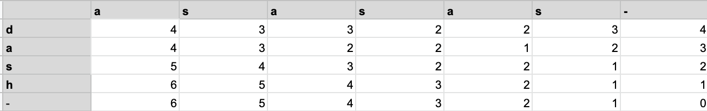
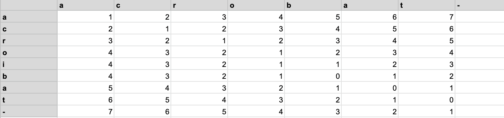
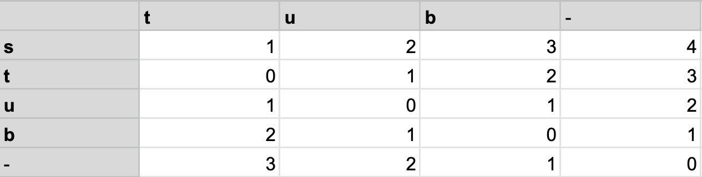
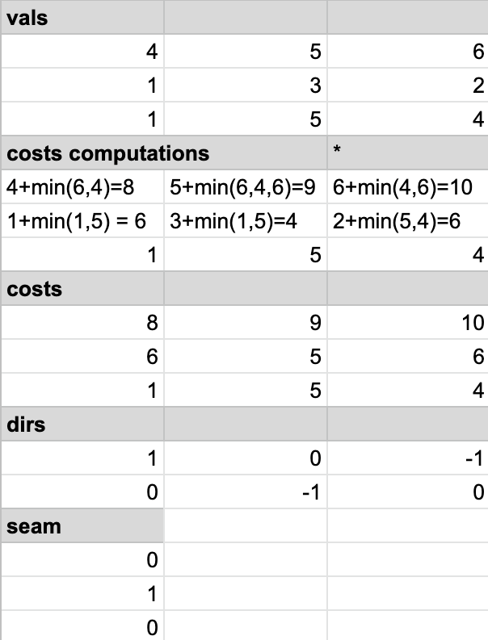

# HW 5 Solution:

## Task 1-d:

We want to see behavior when we have repeat letters that match (i.e. `>2` letters `s` will match our `s` in dash, but only one can "count" for each iteration)

These are the same word seperated by a letter. This should compute 1 operation

This is an instance of one word being a subset of another.
## Task 1-e:
Computation: For a given cell, if the two corresponding letters match, we take the value of the cell as the diagonal-right cell (one down, one to the right). If the corresponding letters do not match, we take the minimum value among the 3 bottom adjacent cells and add one to it (as this is the ideal string that we would come from to get our letter) If they do match, we simply assign our square the minimum value (hence why, if al the letters match, we will have a diagonal line of zeroes)

## Task 1-f: 
Base case: As this defined pattern relies on the existence of cells to the below, bottomright, and right cells for which a condition is impossible (i.e. bottom row and far right column) must be initialized. We see that, as these cells are empty and thus will never match, they always have value n where n is the number of letters they are being compared to. Put differently, buttom row will be initialized as `n,...,0` where the word that we have in our table columns is of length n-1, and the rightmost column will be initialized as `m,...,0` with our row word being of length `m-1`

## Task 1-g: 
One iteration of our process (for one cell located at `(current_row, current_column)`
```
if start-word[current_row] = end-word[current_column]:
    table[current_row][current_column] = table[current_row+1][current_column+1] 
    #Adjacent down
else:
    table[current_row][current_column] = min(table[current_row+1][current_column+1], table[current_row][current_column+1],table[current_row+1][current_column]) + 1
    #Minimum of all diagonally right-below cells
```

## Task 2-c through 2-e
